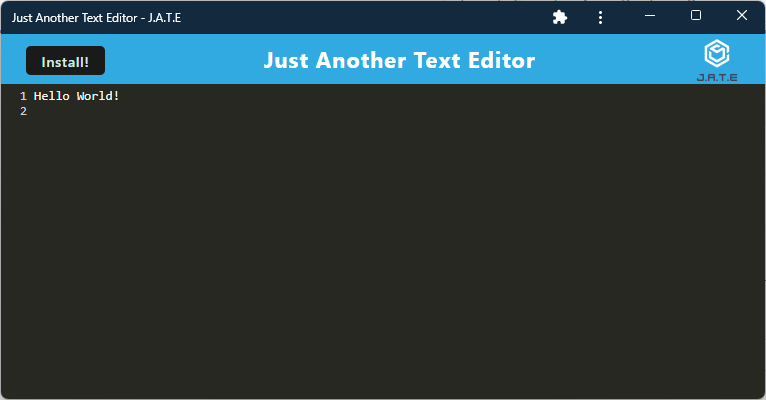

# Just Another Text Editor

[](https://opensource.org/licenses/MIT)

## Description

This project is a text editor that runs in the browser. It is a single-page application that meets the progressive web application (PWA) criteria. Additionally, it features a number of data persistence techniques that serve as redundancy in case one of the options is not supported by the browser. The application also functions offline.

The technologies used in this application are:

- [Node.js](https://nodejs.org/en/)
- [Express.js](https://expressjs.com/) to run the web server
- [localStorage](https://developer.mozilla.org/en-US/docs/Web/API/Window/localStorage) to store the data
- [IndexedDB](https://developer.mozilla.org/en-US/docs/Web/API/IndexedDB_API) also to store the data
- [idb](https://www.npmjs.com/package/idb) as a wrapper around the IndexedDB API
- [WebPack](https://webpack.js.org/) as a static module bundler
- [Workbox](https://developer.chrome.com/docs/workbox/) for service worker libraries
- [concurrently](https://www.npmjs.com/package/concurrently) to run multiple commands concurrently
- [Babel](https://www.npmjs.com/package/Babel) for backward compatibility with older browsers

### User Story

```md
AS A developer
I WANT to create notes or code snippets with or without an internet connection
SO THAT I can reliably retrieve them for later use
```

### Acceptance Criteria

```md
GIVEN a text editor web application
WHEN I open my application in my editor
THEN I should see a client server folder structure
WHEN I run `npm run start` from the root directory
THEN I find that my application should start up the backend and serve the client
WHEN I run the text editor application from my terminal
THEN I find that my JavaScript files have been bundled using webpack
WHEN I run my webpack plugins
THEN I find that I have a generated HTML file, service worker, and a manifest file
WHEN I use next-gen JavaScript in my application
THEN I find that the text editor still functions in the browser without errors
WHEN I open the text editor
THEN I find that IndexedDB has immediately created a database storage
WHEN I enter content and subsequently click off of the DOM window
THEN I find that the content in the text editor has been saved with IndexedDB
WHEN I reopen the text editor after closing it
THEN I find that the content in the text editor has been retrieved from our IndexedDB
WHEN I click on the Install button
THEN I download my web application as an icon on my desktop
WHEN I load my web application
THEN I should have a registered service worker using workbox
WHEN I register a service worker
THEN I should have my static assets pre cached upon loading along with subsequent pages and static assets
WHEN I deploy to Heroku
THEN I should have proper build scripts for a webpack application
```

## Table of Contents

- [Installation](#installation)
- [Usage](#usage)
- [License](#license)
- [Contributing](#contributing)
- [Questions](#questions)

## Installation

### Dependencies

The use of a web browser.

### URL

- [https://dpk5e7-jate.herokuapp.com/](https://dpk5e7-jate.herokuapp.com/)

### Screenshot



## License

[](https://opensource.org/licenses/MIT)

This application is covered under the [MIT License](https://opensource.org/licenses/MIT).

## Contributing

As this project is part of an individual assignment for the University of Denver's Coding Bootcamp, it would be inappropriate for anyone else to contribute to this project.

## Questions

GitHub Link: [https://github.com/dpk5e7](https://github.com/dpk5e7)

Please contact me at Daniel.Kelly@du.edu with any additional questions you may have.
